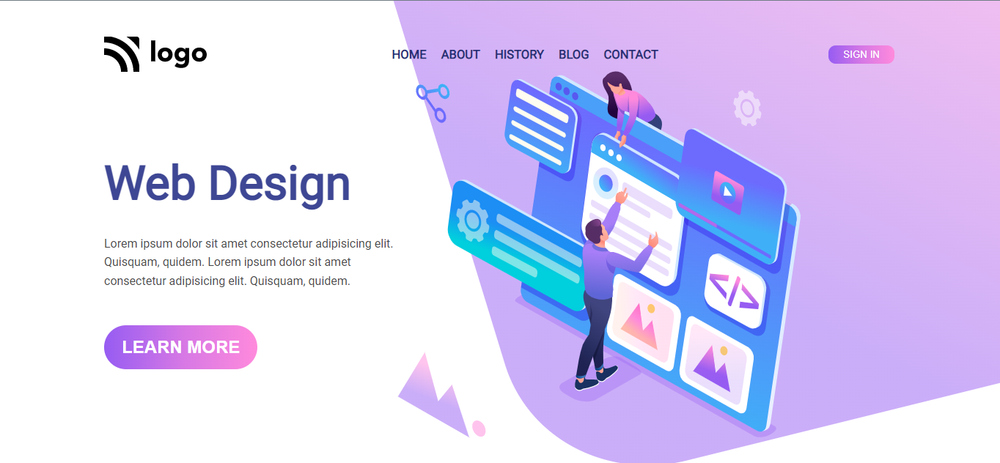

# Project 8

 I am [Nikhil](https://github.com/nikhilbhosale999)

While working on this project I learn about - 
- CSS linear gradient 
- How to handel the SVG file 

### Time Taken - 2 hr

## For Live Website Link - [Click here](https://codecolt-project8.netlify.app)

### Where I learn this -
The course Link - [Click here](https://ineuron.ai/course/Full-Stack-Javascript-Web-Developer)

